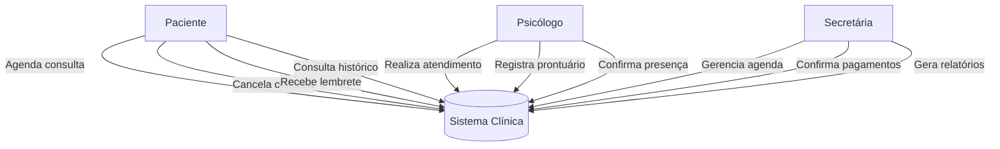

---
# Casos de Uso Completos - Clínica de Psicologia

## UC01 – Agendar Consulta
**Ator Principal:** Paciente  
**Objetivo:** Permitir ao paciente agendar uma nova consulta com um psicólogo.  
**Pré-condição:** O paciente deve estar cadastrado no sistema.  
**Fluxo Principal:**
1. O paciente acessa a agenda disponível.
2. Seleciona a data e horário desejado.
3. O sistema verifica disponibilidade.
4. O paciente confirma o agendamento.
5. O sistema envia confirmação por e-mail/WhatsApp.
**Pós-condição:** Consulta registrada no sistema.

---

## UC02 – Cancelar Consulta
**Ator Principal:** Paciente  
**Fluxo Principal:**
1. O paciente acessa a área “Minhas Consultas”.
2. Seleciona a consulta desejada.
3. Clica em “Cancelar”.
4. O sistema registra o cancelamento e notifica o psicólogo.
**Pós-condição:** Consulta removida da agenda.

---

## UC03 – Registrar Prontuário
**Ator Principal:** Psicólogo  
**Fluxo Principal:**
1. Após a sessão, o psicólogo acessa o prontuário do paciente.
2. Registra observações e evolução clínica.
3. O sistema armazena os dados de forma segura (conforme LGPD).
**Pós-condição:** Prontuário atualizado.

---

## UC04 – Controlar Pagamento
**Ator Principal:** Secretária  
**Fluxo Principal:**
1. Secretária acessa módulo financeiro.
2. Informa pagamento recebido ou pendente.
3. Sistema atualiza o status e gera relatório.
**Pós-condição:** Situação financeira atualizada.

---

## UC05 – Enviar Lembretes
**Ator Principal:** Sistema (automático)  
**Fluxo Principal:**
1. O sistema verifica consultas próximas.
2. Envia lembrete via e-mail ou WhatsApp.
3. Registra log do envio.
**Pós-condição:** Paciente recebe notificação automática.
